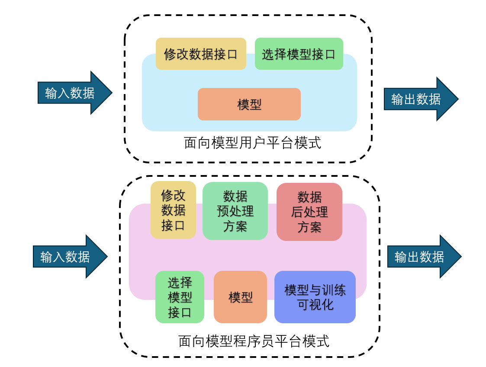
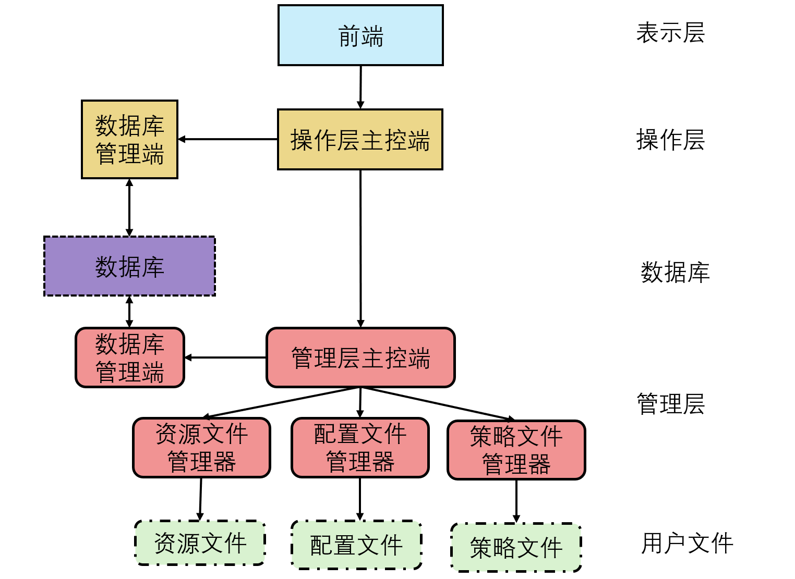
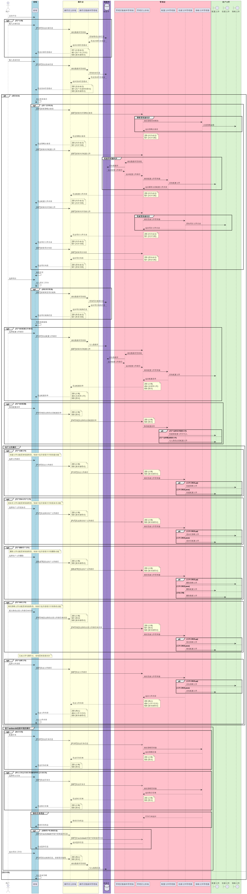

# 夏季学期应用大作业—12组项目设计

## 项目名称

CV WEB：面向高级模型用户的 CV 模型应用管理平台

## 项目背景

### 应用场景

​	随着以深度学习为代表的人工智能技术，特别是在计算机视觉（CV）领域的发展，各类模型已经广泛应用于各行各业。许多人工智能（AI）模型的生产厂家都会开发平台，提供接口供模型使用者调用，使他们能方便地使用模型。然而，模型程序员在开发和调试模型的过程中，仍然需要处理许多重复工作，如数据预处理、数据后处理和数据可视化等。这些任务占用了他们大量的时间和精力，而这些工作可以通过模块化的方式加以简化和优化。

​	当前，许多模型应用平台主要面向模型的最终用户（初级用户），而模型程序员（专业用户）则主要通过编写代码来实现诸如数据处理、可视化以及超参配置的功能。本项目旨在开发一个面向模型程序员的模块化平台，将常见的可复用工作进行封装，减少跨项目复用的成本，并提供良好的可视化和交互界面。这样，模型程序员可以更专注于模型本身的开发和优化工作，提高工作效率。



### 面向用户

​	本平台主要面向拥有一定机器学习模型相关知识的高级、专业用户组成的个人或小型研究团队。为他们提供一个基于项目文件的管理、调度和可视化平台。通过良好的交互性、模块化设计、用户透明原则和优秀的可视化功能减轻用户负担，帮助用户将更多的精力集中于策略开发上。

## 相关工作

​	在当前的技术环境中，有一些平台已经在为模型程序员和开发人员提供支持，这些平台在功能和用户体验方面各有特色。以下是几个典型的相关工作：

1. [**Stable Diffusion Web UI 平台**](https://stabledifffusion.com/webui)：Stable Diffusion Web UI 是一个主要面向图像生成和处理的Web平台。它允许用户使用预训练的模型进行图像生成和编辑。虽然该平台为高级用户提供了许多直观的功能，但其在专业用户需求的支持上仍有所欠缺。它更多地专注于用户友好的界面和基本功能的实现，而不是深度定制和扩展。
2. [**TensorFlow Extended (TFX)**]([TFX | TensorFlow中文官网 (google.cn)](https://tensorflow.google.cn/tfx?hl=zh-cn))：TFX 是一个端到端的平台，专门用于生产环境中的机器学习模型。它提供了一整套用于构建和管理机器学习流水线的工具，包括数据验证、特征工程、模型训练、模型评估和模型部署等。TFX 的模块化设计虽然适合专业的模型程序员，但配置和使用过程中涉及的技术细节繁多，增加了开发的时间成本和学习成本。此外，TFX 偏重于生产环境中的部署和管理，对于开发过程中需要频繁调试和快速迭代的场景支持不足。
3. [**MLflow**]([MLflow | MLflow](https://mlflow.org/))：MLflow 是一个开源平台，旨在管理机器学习的全生命周期。它支持实验跟踪、项目管理、模型管理和模型部署。虽然其开放性和灵活性使其成为许多数据科学团队的首选工具，但其用户界面相对简陋，缺乏直观的可视化功能。MLflow 更适合有经验的开发人员使用，对于初级用户或需要复杂可视化支持的场景，可能显得不够友好和直观
4. [**PaddlePaddle (百度飞桨)**](https://www.paddlepaddle.org.cn/))：PaddlePaddle 是百度开源的深度学习平台，具有高效的训练和推理能力。尽管 PaddlePaddle 提供了一些高层 API 和工具，其在可视化界面上也做出了重要尝试，但其平台仍然较为简陋和不稳定，缺乏针对性的模块化开发和调试工具。
5. [**KubeFlow**]([Kubeflow](https://www.kubeflow.org/))：KubeFlow 是一个基于 Kubernetes 的开源平台，专为机器学习工作流的管理而设计。尽管 KubeFlow 提供了强大的分布式计算能力，但其部署和管理过程较为复杂，对基础设施的要求较高。对于需要灵活、快速开发和迭代的场景，KubeFlow 的配置和维护成本较高，不太适合个人开发者或小型团队。


## 总体设计

### 项目环境

- 深度学习开发框架：PaddlePaddle
- 系统：Windows 10、Linux
- 用户文件语言：python
- 项目后端语言/框架：待定
- 项目前端框架：待定

### 系统协议

##### 系统特点与设计理念

​	CV-WEB 平台是以 CV 领域的深度学习项目为预设设计的脚本管理系统，但鉴于其优秀的模块化和透明设计，CV-WEB的实际功能非常强大（同时也很弱小），其实际应用领域并不限制于 CVDL 项目。就目前的版本而言，只要满足文件和函数规范的所有项目都可以被 CV-WEB 对接（要不我们后面改个名字吧hh）

##### 项目、任务与策略

​	CV-WEB 通过 `项目` 区分独立的用户工作；每个项目在原则上由多个 `任务` 组成，用户通过组织和完成 `任务` 实现完成项目的目的；`任务`  的实现方式被称为 `策略`，它们的详细含义如下：

- **项目**：项目的文件表示是用户与我们的系统管理层工程文件夹 `CVWEB` 放置在同一级目录下的文件夹，每个文件夹都被视作一个独立的项目，例如：

  ```
  项目目录
  ├── 用户项目_1
  ├── 用户项目_2
  └── CVWEB平台
  ```

  如此，系统就将能够区分并接管两个用户项目 `用户项目_1` 和 `用户项目_2`。

- **任务**：任务没有具体的文件表示，而是逻辑上的步骤，是策略的调度与执行。例如：用户进行  ` 数据预处理` 任务，实际上需要经过 `数据裁剪`、`数据二值化` 等步骤，  ` 数据预处理` 是一个抽象的逻辑步骤，它本身实际上只有一个名字属性，以便用户在逻辑上整理和划分自己的项目工作。同时， `数据裁剪`、`数据二值化` 等步骤是具体的执行方式，它们便是 `策略`，`策略` 的修改和选择并不影响任务的逻辑性质（除非用户对任务的逻辑定义脱离了其真实执行的目的），用户可以选择各种合适的 `策略` 来完成任务。

- 策略：策略指定了执行方式，是将逻辑上的某个特定任务步骤链接到具体对应的程序段的定向。由于程序段的高度多样性，策略拥有更复杂的约定以便于系统接管。策略与策略文件和策略函数有关，我们将在用户文件说明中详细展示它们的关系。

##### 三种用户文件

​	为了便于兼顾 Linux 平台和遵守透明化模块化的管理方式，平台的一切操作对象皆为文件，主要分为资源文件、策略文件和配置文件：

- **配置文件**：配置文件必须是 `.json` 格式的字典。配置文件指定了对应策略的各个超参数的值。

- **策略文件**：策略文件必须是 `.py` 的脚本文件。策略文件中包含许多函数，但并不是所有函数都是策略函数，只有符合协议的函数才是”规范的“，规范的函数可以成为策略函数：

  - 策略函数的所有参数内容，只能被从配置文件中的配置项指定，或由同一个任务中具有直接前驱关系的函数的输出提供。
  - 策略函数的输出，要么一定会被用一个任务中具有直接后继关系的函数的参数接受，要么在函数内部写入外存。
  - 策略函数内部可以调用普通函数，或策略函数，或做任何事情，但函数内部的任何行为都不会直接被系统察觉，用户需要自行管理安全性等问题。

  策略函数可以被看做一个策略的入口函数，一旦这个函数被调用则代表一个策略被开始执行了。

  一个函数被称为策略函数意味着它满足了策略函数的约定，但是只有当用户将策略函数注册后，才能被系统识别为策略，只有策略可以被系统接管。

- **资源文件**：除了配置文件与策略文件以外的一切项目文件被视作资源文件。需要注意的是，系统提供了对所有用户文件的渲染支持，即用户可以在前端查看文件，但是配置文件和策略文件被规定了文件格式，相当于隐含指定了渲染方式。而资源文件是自由格式的，这意味着系统只能在一定程度上支持一些常见格式的渲染，不支持的格式应该被经过策略加工后，转为常见格式才能被前端渲染，同时前端支持一些基础的展示选择与工具。

### 用例图


### 系统的分层结构

​	从总体上来看，系统分为五层。自底向上看：

- 用户文件：用户的项目组成。用户文件以及其中的部分内容需要遵守协议才能与系统对接。用户文件对上层不完全是透明的，对于资源文件和配置文件管理层拥有一切必要信息的知情权；而对于策略文件，需要用户通过注册函数入口的方式提供管理层策略调度接口，而策略的实现是透明的。
- 管理层：对下层而言，管理层对用户文件进行管理；对上层而言提供相应的接口。管理层主要与深度学习框架协同完成用户任务，对操作层是透明的。管理层相当于用户任务与系统任务的过渡，降低任务之间的耦合度。
- 数据库：数据库属于系统资源，主要用于维护用户信息和项目现场，用户文件内容不会被数据库保存。
- 操作层：基于 Java 的系统业务管理层，负责接受前端的请求并执行响应。操作层不会进入深度学习框架直接参与用户任务，而是通过调用管理层的接口调度各项事务的有序进行。
- 表示层：基于 WEB UI 开发的可视交互界面。


​	借助分层结构可以进一步说明系统的任务逻辑：在用户任务的基础上，系统允许用户通过系统任务来间接地执行和管理用户任务，实现对用户任务的上层接管。

​	在此基础上，进一步给出层内模块关系：



​	从层内模块关系也可以看出，用户文件与管理层的耦合度是较高的，这是管理层的介入性质。而管理层与操作层、操作层与表示层之间都通过唯一的控制端进行通信。

### 前端功能设计

#### 选择文件路径

略

#### 显示和修改表项

略

#### 选择策略

略

#### 数据渲染

​	前端需要渲染的数据主要来自用户的资源文件与日志信息。

​	对于数据分为以下类型：

- 2D 图像数据
  - 对于前端框架支持的常见格式（如`.jpg`、`.png`、`.bmp`等）可以直接渲染
  - 对于非前端框架支持的格式，需要调用用户策略进行处理，随后以通用数据结构（例如 `array` ）进行渲染展示。展示方式分为平铺展示和单图展示。
- 3D 图像数据
  - 对于前端框架支持的常见格式（如`.nii.gz`、`.stl`等）可以直接渲染
  - 对于非前端框架支持的格式，需要调用用户策略进行处理，随后以通用数据结构（例如 `array` ）进行渲染展示。展示方式分为 3D 展示和切片展示，切片展示方式分为平铺展示和单图展示。
- 日志文件数据
  - 日志文件数据将以曲线图的形式渲染

### 操作层模块设计

操作层作为系统的中间层，负责接收前端的请求并调度管理层完成相应的操作。

#### 操作层主控端

**功能**：

- 接收并解析前端的请求，包括但不限于预处理请求、训练请求和推理请求。
- 根据请求类型，调度相应的模块进行处理。
- 接收模块返回的结果并转发给前端。

**设计**：

- 前端发起请求，请求可能包括预处理请求、训练请求和推理请求等。
- 操作层主控端接收并解析请求，确定请求类型。
- 根据请求类型，调度相应的模块进行处理。例如，如果是预处理请求，则调度数据预处理模块进行处理。
- 接收模块返回的结果并转发给前端。

### 管理层模块设计

管理层作为系统的核心，负责介入用户任务，管理用户文件和提供调度接口。

#### 管理层主控端

**功能**：

- 接收并解析操作层的请求，包括但不限于配置文件处理请求、资源文件处理请求和策略文件处理请求。
- 根据请求类型，调度相应的模块进行处理。
- 接收模块返回的结果并转发给操作层。

**设计**：

- 操作层发起请求，请求可能包括配置文件处理请求、资源文件处理请求和策略文件处理请求等。
- 管理层主控端接收并解析请求，确定请求类型。
- 根据请求类型，调度相应的模块进行处理。例如，如果是配置文件处理请求，则调度配置文件管理器进行处理。
- 接收模块返回的结果并转发给操作层。

#### 配置文件管理器

**功能**：

- 响应操作层的配置文件处理请求，接受操作层发送的配置文件路径等信息。
- 读取和解析配置文件，提供配置文件的修改和保存功能。

**设计**：

- 操作层发起配置文件处理请求，请求中包含配置文件路径等信息。
- 配置文件管理器接收请求，读取指定路径的配置文件并解析内容。
- 返回解析后的配置文件内容给操作层。
- 接收操作层的配置修改请求，更新配置文件并保存。

#### 资源文件管理器

**功能**：

- 响应操作层的资源文件处理请求，接受操作层发送的资源文件路径等信息。
- 读取和管理资源文件，提供资源文件的访问和修改功能。

**设计**：

- 操作层发起资源文件处理请求，请求中包含资源文件路径等信息。
- 资源文件管理器接收请求，读取指定路径的资源文件。
- 返回资源文件内容给操作层。
- 接收操作层的资源修改请求，更新资源文件并保存。

#### 策略文件管理器

**功能**：

- 响应操作层的策略文件处理请求，接受操作层发送的策略文件路径等信息。
- 读取和管理策略文件，提供策略文件的注册和调用功能。

**设计**：

- 操作层发起策略文件处理请求，请求中包含策略文件路径等信息。
- 策略文件管理器接收请求，读取指定路径的策略文件并注册策略。
- 返回策略注册表给操作层。
- 接收操作层的策略调用请求，执行相应策略并返回结果。



### 数据库模块设计

数据库和操作层、管理层直接连接，实现登录验证、任务信息存储、项目及成员管理等功能

**功能**：

* 实现登录验证
* 存储任务信息(留档)
* 项目及成员管理

**设计**：

* 数据库和操作层、管理层分别直接连接
* 登录的时候表示层把登录表单发到操作层，操作层拿着表单去数据库中查询用户信息，判断用户是否可以登录，可以登录的话发放令牌
* 用户创建项目，向数据库中插入项目信息，同时插入项目成员信息
* 用户可以拉其他用户到项目中，对应地更新项目成员表
* 项目状态在项目信息表中维护


## 详细设计

### 数据库

SQL

#### 登录信息表

* 账户id(主键)
* 账户密码(SHA256+加盐 加密)

类型如下：
```sql
CREATE TABLE users(
  user_id INT UNSIGNED NOT NULL AUTO_INCREMENT PRIMARY KEY,
  user_password char(64) NOT NULL
)AUTO_INCREMENT=100000000 DEFAULT CHARSET=utf8mb4;
```

#### 项目信息表

* 项目id(主键)
* 配置文件路径
* 项目状态
  * 有他人造成的修改
  * 正在进行任务
  * 不在进行任务
  * 有异常
  * 任务完成

<!-- ```sql
CREATE TABLE task(
  task_id INT UNSIGNED NOT NULL 
)
``` -->

#### 项目成员表

* 项目id
* 成员用户id
